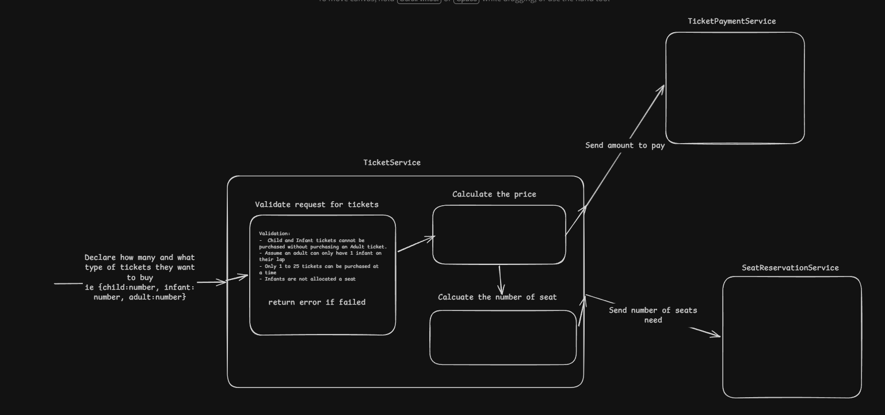

# CINEMA TICKETS

A Javascript service which simulates a microservice connections between 'TickerService.js', TicketPaymentService.js and ServiceReservationService.js.

For this test, I will be mainly focusing on fleshing out TickerService.js so it can meet the following business conditions below. I will aso be writing clean, well-tested and reusable code.

The main logic is in the TickerService Class located in TicketService.js. It accepts a numeric account id and an array of TicketTypeRequests. There are 3 types of tickets: Adult, Child and Infant. The service will validate against business rules, calculate the total cost of the purchase and number of seats required, then call third party services to take payment and reserve seats. The service will return the total cost of the tickets plus the number of seats reserved.

# Business rules and conditions



- There are 3 types of tickets i.e. Infant, Child, and Adult.

- The ticket prices are based on the type of ticket.

- The ticket purchaser declares how many and what type of tickets they want to buy.

- Multiple tickets can be purchased at any given time.

- Only a maximum of 25 tickets that can be purchased at a time.

- Infants do not pay for a ticket and are not allocated a seat. They will be sitting on an Adult's lap.

- Child and Infant tickets cannot be purchased without purchasing an Adult ticket.

- There is an existing `TicketPaymentService` responsible for taking payments.

- There is an existing `SeatReservationService` responsible for reserving seats.

## Assumptions

- All accounts with an id greater than zero are valid. They also have sufficient funds to pay for any no of tickets.

- The `TicketPaymentService` implementation is an external provider with no defects.

- The payment will always go through once a payment request has been made to the `TicketPaymentService`.

- The `SeatReservationService` implementation is an external provider with no defects.

- The seat will always be reserved once a reservation request has been made to the `SeatReservationService`.

# Logic to apply

Looking at the business rules and assumptions, we formate that into logic and validations we should apply to the code.

## Ways validation would fail

- If child and infant tickets are selected without an adult ticket ie {child : 1+, infant: 1+, adult : 0 }
- At least one adult ticket must be purchased

## Our own assumption

- A adult can only have 1 infant on their lap so the # adult ticket must be greater or equal to # infant tickets

# Setup

The services uses Node version 24.14.1 the LTD version of node as of writing this. An 'nvmrc' file is provided and we can switch to use this node version with the command

```
nvm use
```

To install packages and dependencies:

```
npm install
```

We start the service via the command:

```
npm run start
```

# Tests

The unit tests can be ran with

```
npm run test:unit
```

Linting test would check our code quality from the linting rules. We can run these test by the following command.

```
npm run test:lint
```
